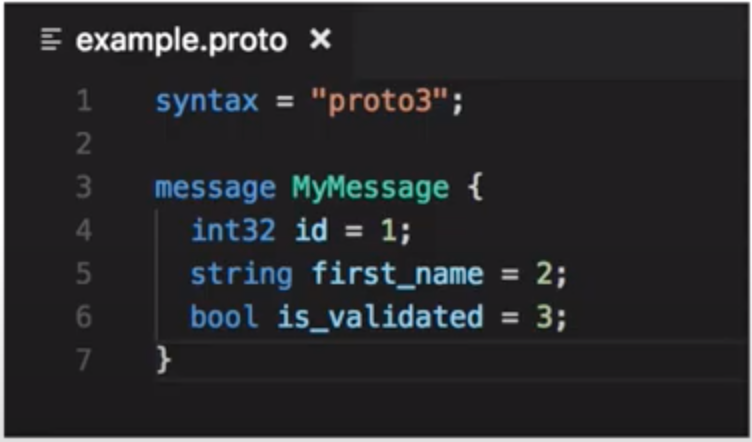
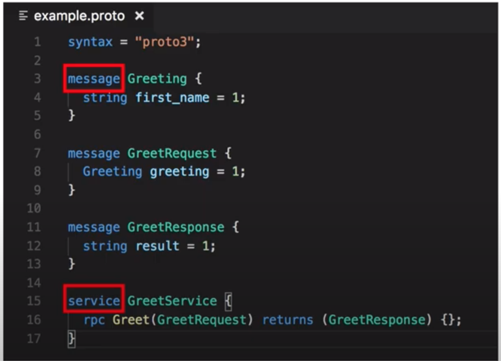
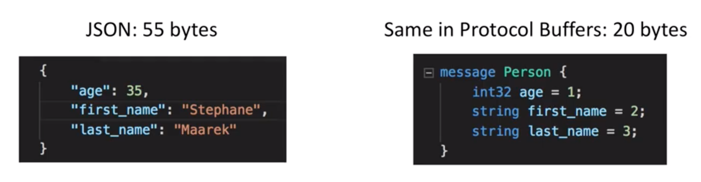
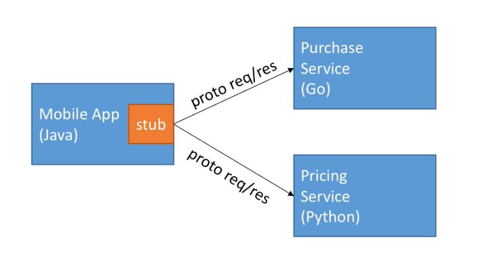

# Evolution of data
- CSV
    - Headers
    - Row
    - Columns
    - Easy to parse/read/make sense
    - Break on data with comma, not fit for data 
- Relational database
    - Advantage
        - Create table
        - Data is fully types
        - Data fits into table
    - Disadvantage
        - Data must be flat
        - Data is stored in database, and data definition will be different for each database
- JSON
    - Able to share across network
    - Advantage
        - Any format
        - 
    - Disadvantage
        - No schema
        - Very big in size due to key repeat
        - No comments
- Protocol buffers
    - Defined as `.proto` text file
        
    - Easy to read
    - Advantage
        - Data is fully typed
        - Data is compressed automatically
        - Schema defined using .proto file is needed to generate code and read data
        - Documentation can be documented in schema
        - Data can be read across many languages
        - 3-10x smaller, 20-100x faster than XML/JSON
        - Code is generated automated
    - Disadvantage
        - Can't open the serialized data with a text editor (bcz it is compressed and serialized)
    - Google uses for almost all internal application
# Protocol buffers role in gRPC
    Protocol buffers is used to define following
    - Message: data, request and response
    - Service: Service name and RPC endpoint
    
    We then generate code from it. 
# Efficiency of Protocol buffers over JSON
- gRPC uses protocol buffers for communications
- Payload size

- Parsing JSON is CPU intensive (bcz format was meant for human)
- Parsing Proto buffer is less CPU intensive 
- Friendly with mobile devices that have slower CPU
# Generate code using gRPC
https://grpc.io/docs/languages/node/quickstart/
gRPC has  following implementations
- Pure Java
- Pure Go
- Pure C
    - C++
    - C#
    - Python
    - Node.js
Because the code can be generated for any languages, it makes super simple to create micro services in any language that interact with each other

